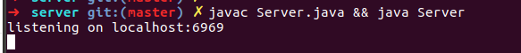

# securedchat
Toy project to do clent server authentication

The server and client run in different processes. They need to be run in different
command line terminals.

# Sever

Compile the server in the server folder

```
cd server
javac Server.java
```
then run the server

`java Server`

You should see the following output when running the server


