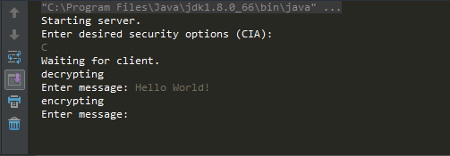

# securedchat

Created by, V00807046 - Andrei Taylor, V00849182 - Duc Nguyen, V00809321 - Justyn Houle, V00811400 - Sam Taylor 


Toy project to do do secure local messaging.

The server and client run in different processes. They need to be run in different
command line terminals. They use AES encryption to perform authentication although
this is easlily changed.

## Folder Permission
In order for the app to function, there needs to be some modification to the permission. 

Both the client and the server needs to have permission of the folder. In order to achieve this, run this command:

```bash
sudo chown -R $USER:$USER FOLDER_NAME
```

Both client and server needs to be added to a new group and the group needs to be granted permission for the folder.
To create a new group and add the client/server to the group, run:

```bash
sudo groupadd CLIENT_GROUP
sudo adduser CLIENT CLIENT_GROUP
```

```bash
sudo groupadd SERVER_GROUP
sudo adduser SERVER SERVER_GROUP
```

Last thing to add is the permission of the new group to access the folder.
To add the folder to be part of the new group, run:

```bash
chgrp groupA ./folderA
```

To grant the group permission to the folder, run:

```bash
chmod g+rwx  ./folderA
```
## How to run

Compile the client/server in the src folder

```bash
javac SecureChat.java Message.java MessageReader.java MessageWriter.java
```

then run the server with

```bash
java SecureChat --server
```

then run the client (in a separate terminal)

```bash
java SecureChat --client
```

## How it works

The chat application works by sending messages from client to server and vice versa.

On server side, invoke:
java SecureChat –server
After starting up, the server will ask for the desired configuration of security options (None, Confidential, Integrity, Authentication). 
After waiting for client, enter the message. In this example the message is “Hello World!”



On client side, invoke: 
java SecureChat –client
After starting up, the client will ask for the desired configuration like above. Enter the configuration
After establishing the connection, the client will receive a message from server and attempt to decrypt it. In this example, it successfully decrypted String “Hello World!”


The client must be commence the connection and once the server sees the connection a bidirectional channel is created between the client and the server.


### Security options

There are three independent options for security between the client and the server.

1. Confidentiality: The message and password (if selected below) are both encrypted when being sent between the client and server.
2. Integrety: If selected this will ensure a encrypted check sum is sent along with the message. Note that the encryption of this check sum is exclusively to validate that the client is the origin of the message. It is not related to the Confidentiality of the message in any way.
3. Authentication: if slected this will request a password on both client and server to validate each other before messages can be sent. This is encrypted only if the Confidentiality is selected above.

These options are independent and must be agreed upon by both the client and the server. If there is not an agreement then no connection is made.

Note that due to the independent nature of the above options there is up to 7 different configurations of the security options

```text
None: Message is sent in plain text
C: Message is encrypted
I: Checksum is sent with message
A: Password authentication is used
CI: Message is sent encrypted with Checksum
CA: Message is sent encrypted, passwords used for authentication
IA: Checksum is sent with unencrypted message and passwords used for authentication
CIA: Checksum is sent with encrypted message and passwords used for authentication
```


### How messages are sent

The Client and server pass messages to eachother through files in protected folders. The server user is called {Add server here} and the client is called {Add client user here}. The permissions for these two users only allow the server to write to the *clientInbox* folder without being able to read and the *serverInbox* folder is able to be written by the client and read by the server.

When a message is sent to the client or server the respective agent polls their folder and picks up that there is a change available. Then the options which were agreed upon during the connection stage are used to read the incomming message.

On failure of reading the message a error is displayed.


## Limitations

- the program is tested to currently allow one of either the client or server to send a message at a time
- manual setup of the folder permissions must be set up on each machine that this program is run on
- we are currently only supporting Ubuntu 17.10.


## Technical Details

### SecureChat Class

The main class of the application that performs all client and server initialization tasks and then starts the MessageRead and MessageWrite threads.

#### Methods

- ```void initServer()``` Performs all server initialization steps including comparing selected security options to client security options and password authentication.

- ```void authorizeServerPassword()``` Compare user input to pbkdf2 hashed password.


- ```String generateStrongPasswordHash(String password)``` Generates a password hash using PBKDF2 with HMAC-SHA1 encoding.

- ```byte[] getSalt()``` Generates a new salt and stores it to a file.

- ```void authenticateClientMessage(String messageFilePath, File f)``` Authenticates client options and passwords messages. Sends the corresponding confirmation or error message response.

- ```void initClient()``` Performs all client initialization steps including sending selected options to server and password authentication.

- ```void getSecurityOptions()``` Sets options array values from stdin input txt.

- ```void setOptions(String optionsString, boolean[] optionsArr)``` Sets optionsArr from a string of options in optionsString.

- ```void sendOptionsMessage(String messageFilePath)``` Sends a message with selected options to messageFilePath.

- ```void waitForMessage(String inboxDir)``` Wait for a message to be received in inboxDir. Waits for a short ammount of time to allow file to be successfully written before it is read.

- ```byte[] getHash(String message)``` Hash string message using SHA-1.

- ```void printUsage()``` Prints a help message for how to run the program.


### Message Class

Class used for handling messages. Stores message type and contents. Provides functions for reading and writing messages.


#### Methods


- ```void writePlainTextMessageFile(String messageFilePath)``` Write a plain text message to a file. No encryption done here.

- ```void writeMessageFile(String messageFilePath, boolean[] options, boolean forceEncrypt)``` Write a message to a file with encryption if it is specified in options. Encryption can be forced with the forceEncrypt parameter (used for checksum files).

- ```void readPlainTextMessageFile(String messageFilePath)``` Read a plain text message to a file. No encryption done here.

- ```void readMessageFile(String messageFilePath, boolean[] options, boolean forceDecrypt)``` Write a message to a file with encryption if it is specified in options.Encryption can be forced with the forceEncrypt parameter (used for checksum files and initialization messages).

- ```static SecretKey generateOrGetSecretKey()``` Gets a secret key stored in a file or generates a new secret key if the file does not exist.


### MessageWriter Class

Thread class to get input from std in and store it in a message file (sending it to the server).

#### Methods


- ```void run()``` Runs an infinite loop that checks for text input then writes messages to a file.


### MessageReader Class


Thread class to read messages from message files and writes contents to std out.


#### Methods


- ```void run()``` Runs an inifinite loop that checks for new messages and processes them on arrival. Performs checksum authentication.
